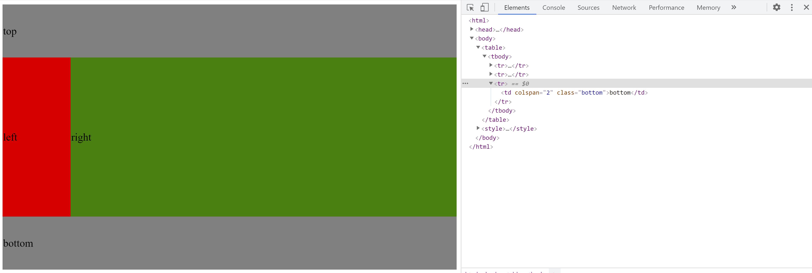

# 掌握table布局

## table布局的特点

大概在2007年之前，基本上布局方案就只有table布局这一种。table能成为一种早期的布局方案，归功于table的行、列、块的特性，使用table可以轻松实现多列、等高等布局。table布局分为两种实现手段，第一种就是早期的使用HTML的table标签来布局（称为HTML table布局），第二种是后来CSS规范中提出的使用display属性来实现table布局（称为CSS table布局）。table布局在现在的实际开发中使用的很少了，早期的浏览器并不是以流的方式来渲染table，这会造成越大的table渲染时间越长，体验非常不好，后来table布局就逐渐被其他技巧性布局所替代。不过随着浏览器的进步，以及CSS规范将table布局的特性纳入了标准，现在仍然可以在适当的时候使用CSS table布局。


## table布局的用法

### HTML table布局用法

实现一个简单的顶部+侧边栏+底部的布局：

```html
<html>
    <head>
        <title>table布局</title>
    </head>
    <body>
        <table>
            <tbody>
                <tr>
                    <td colspan="2" class="top">top</td>
                </tr>
                <tr>
                    <td class="left">left</td>
                    <td class="right">right</td>
                </tr>
                <tr>
                    <td colspan="2" class="bottom">bottom</td>
                </tr>
            </tbody>
        </table>
    </body>
</html>

<style>
    table {
        width: 100%;
        height: 500px;
        border: none;
        font-size: 20px;
    }
    .top, .bottom {
        background: grey;
        height: 20%;
    }
    .left {
        background: red;
        width: 15%;
    }
    .right {
        background: green;
    }
</style>
```

效果如图：

