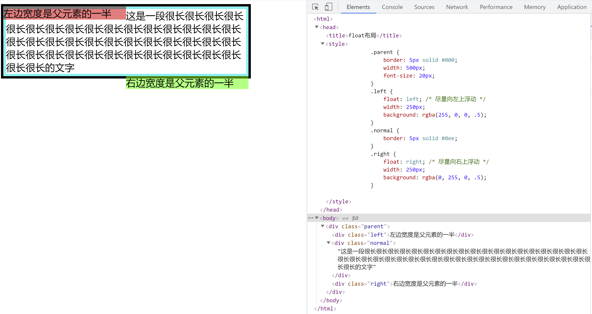

# float布局

## float属性的历史

早期，出现float属性其实是用来实现类似于word中的文字环绕图片的效果，后来人们发现float属性可以用来实现一些布局效果，就有了浮动布局这种布局方案。也正是因为float属性原本不是为布局而生，所以在布局方案中有一些“缺陷”（父元素高度塌陷），下文中会解释这种“缺陷”产生的原因及其消除方法。

## float属性的用法及其特性

float属性定义了元素在哪个方向浮动，这个属性可以作用于任何元素，不论这个元素是什么类型的，加上浮动属性都会会生成一个块级框。

<table>
    <thead>
        <tr>
            <td style="width: 30%; font-weight: blod;">取值</td>
            <td>描述</td>
        </tr>
    </thead>
    <tbody>
        <tr>
            <td>none</td>
            <td>默认值。不浮动。</td>
        </tr>
        <tr>
            <td>left</td>
            <td>向左浮动</td>
        </tr>
        <tr>
            <td>right</td>
            <td>向右浮动</td>
        </tr>
        <tr>
            <td>inherit</td>
            <td>继承父元素的float属性值</td>
        </tr>
    </tbody>
</table>

来看一个实例：

在这里例子中，向左浮动的div.left元素和一段很长的文字（蓝色边框内的文字）实现了文字环绕效果，向左浮动的元素会贴着最近的一个元素尽量向左上浮动，这里向左浮动的元素前面没有其他元素了，它就贴着父元素div.parent的左上进行定位的。向右浮动的div.right元素也会提着最近的一个元素尽量向右上浮动，由于这里向右浮动时前面有一个div.normal元素（蓝色边框的元素），所以向右浮动的元素是贴着这个div元素向右上定位的。

从上面这个例子中可以看出float属性的两个特性：

#### 特性一——**浮动元素脱离文档流，但不脱离文本流**

脱离文档流——向左浮动的div.left元素与div.normal这个在正常文档流中的元素有重叠，说明float元素不会影响其他元素的位置；

不脱离文本流——向左浮动的div.left的元素将div.normal元素中的文字向右边挤压了一部分位置，说明浮动元素会影响它左右文本的位置。这恰恰是float属性的最基本的作用——实现文字环绕效果。

#### 特性二——float元素不影响父元素的高度

从上面的例子中可以看到，父元素div.parent刚好包裹住了div.normal元素，而向右浮动的div.right元素被父元素抛弃在外了，这时父元素的高度完全是由div.normal元素撑起来的。可以想象下，如果没有div.normal元素，只剩下div.left和div.right这两个浮动元素，则父元素div.parent的高度会呈现出一种塌陷效果。

#### 特性三——超过父元素高度的浮动元素不会影响父元素后面的兄弟元素的定位，但是会影响兄弟元素中文本的位置

下面这个实例中，给向左浮动的元素div.left设置一个固定高度使其超过父元素div.parent的高度，给向右浮动的元素div.right设置一个宽度，可以看到，浮动元素超过父元素的高度后，并不会影响父元素的兄弟元素div.parent2的定位，但是却影响了div.parent2中的文本位置。div.left元素将div.parent2中的文本向右边排挤了，div.right元素又将文本向左排挤了。

从上面的例子中，我们了解了float属性的特性，可以发现它很适合做横向布局，比如左右定宽、中间自适应布局：

## 解决高度塌陷

#### 产生父元素高度坍塌的原因

前文中解释了浮动元素的一个特性——不影响父元素的高度。这是因为浮动元素脱离了正常的文档流，如果父元素没有设置高度，则其高度由在正常文档流中的子元素决定。这样就会出现一个问题：父元素有可能包裹不完浮动元素，甚至如果所有子元素都是浮动的，父元素的高度就会为0。

#### 解决方法——清除浮动

要解决父元素高度坍塌的问题，自然想到的就是让父元素的高度能包裹住浮动元素的高度。最简单直接的就是设置父元素的固定高度，使其可以包裹住浮动子元素的高度，但是这显然是一个笨办法，更好的办法称之为——清除浮动。

**清除浮动方法之一——利用clear属性**

这个方法的原理是，给父元素中所有浮动元素之后再增加一个子元素，则父元素的高度会自动包裹住这个子元素，再给这个子元素设置clear:both;来清除左右浮动，就可以达到父元素高度包裹住所有浮动元素的高度的效果了。

这个例子中为了看出区别，给div.clear这个元素上加了文字，去掉文字后，这个元素的高度就为0了，就能达到父元素高度刚好包裹住最高的浮动元素div.left的效果了。

但是这种方法额外多增加了一个无语义的空白元素，所以有了进一步的改进办法，就是在父元素后加上一个::after伪元素，代码就清晰简洁了许多：

**清除浮动方法之二——BFC**

这个方法的原理是让父元素形成一个BFC块。