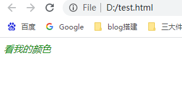
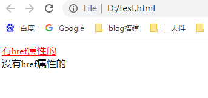
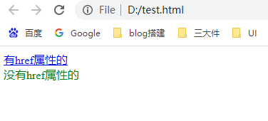
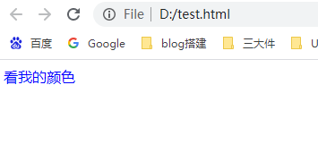
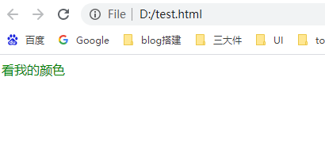

## CSS权重是啥

浏览器需要一套规则（标准）来抉择元素的样式，这套规则的核心就是css权重，权重高的css样式才会生效。

W3C中规定了：

> Specificity is the means by which browsers decide which CSS property values are the most relevant to an element and, therefore, will be applied. Specificity is based on the matching rules which are composed of different sorts of CSS selectors.
>
> Specificity is a weight that is applied to a given CSS declaration, determined by the number of each selector type in the matching selector.

翻译下：

> Specificity（相关性）：哪些css属性值与其元素最相关，浏览器就会应用这些属性值。不同的css选择器有不同的权重，相关性就是根据不同的选择器的数量来决定的。

简而言之，不同的CSS selectors类型有不同的权重，根据这些CSS selectors类型的**数量**，决定了哪个属性值与元素的关系最紧密，这个属性值就会被应用到这个元素上。


## 选择器类型的权重

css选择器根据权重分为4种类型：

a、声明在style=""中的属性

b、ID选择器

c、类选择器、属性选择器、伪类选择器

d、标签选择器、伪类

计算css权重时，按照(a, b, c, d)这个顺序来，谁的数量多，谁的权重就大。一般来说，声明在style中的属性值，肯定会被应用，常常需要比较权重值的是b、c、d这三类选择器。

举个简单的例子说明：

```html
<div class="class1">
	<div id="id1">
		<p>看我的颜色</p>
	</div>
</div>

<style>
div.class1 p { /*有div选择器，同时也有class1的类选择器，后代中有p标签选择器的元素*/
  font-style: italic;
	color: red;
}
div#id1 p { /*有div选择器，同时也有id1的ID选择器，后代中有p标签选择器的元素*/
	color: green;
}
</style>
```

浏览器运行结果：



权重计算过程：

这里都没有style，div.class1 p 这个声明中，有0个id选择器、1个class选择器（class1）、2个标签选择器（div，p），所以权重是（0, 0, 1, 2）；div#id1 p这个声明中，有1个id选择器（id1）、0个class选择器，2个标签选择器（div，p），所以权重是（0, 1, 0, 2）。

（0, 0, 1, 2）

（0, 1, 0, 2）

每个位置的数字进行对比，从左到右，比较到第二个数字的时候，下面的权重大一些，所以div#id1 p这个声明下的color属性值生效了，但是这条声明中没有font-style属性值，所以div.class1 p中的font-style属性值生效了。


再看一个复杂点的例子：

```html
<html>
    <head>
    </head>
    <body>
        <div class="class1">
            <div id="id1">
                <a href="www.baidu.com">有href属性的</a>
                <br />
                <br />
                <a>没有href属性的</a>
            </div>
        </div>
    </body>
    <style type="text/css">
        div.class1 #id1 a[href]:hover{ /*带有href属性的a标签，在hover时变成红色*/
            text-decoration: none;
            color: red;
        }
        div.class1 #id1 a:hover { /*a标签，在hover时变成红色*/
            color: green;
        }
    </style>
</html>
```

想一下上面两个链接在hover时分别是什么颜色？来计算下权重，div.class1 #id1 a[href]:hover这个声明中，有1个id选择器(#id1)、1个class选择器（.class1）+ 1个属性选择器（[href]）+ 1个伪类选择器（:hover），2个标签选择器（div、a）；div.class1 #id1 a:hover这个声明中，有1个id选择器(#id1)、1个class选择器（.class1）+ 1个伪类选择器（:hover），2个标签选择器（div、a）。

所以权重分别是：

（0, 1, 3, 2）

（0, 1, 2, 2）

所以带有href属性的a标签在hover时是红色的。





## 相同选择器的权重会累加吗？会！

举例：

```html
<html>
    <head>
    </head>
    <body>
        <div class="class1">
            <div id="id1">
                <p>看我的颜色</p>
            </div>
        </div>
    </body>
    <style type="text/css">
        .class1.class1 p{ /*我的权重更大*/
            color: red;
        }
        .class1 p {
            color: green;
        }
    </style>
</html>
```

上面例子中生效的是red，因为它有2个类选择器，虽然都是class1。这里仅仅举了class选择器，但是这个累加规则是针对权重计算规则中所有选择器有效的。


## 其他选择器

上面的权重计算规则中，还有些选择器没有提到，相邻兄弟选择器（+）、通用选择器（*）、子选择器（>），这些选择器都是不影响权重的。特别的，:not()选择器本身不计算权重，但是写在它里面的css选择器是要被计算的。


## 权重一致时怎么办

当计算出来的权重是一模一样的，当然就是在后声明的属性值才会生效了。


## 不要使用！important

当一个属性值后跟了!important时，这个声明会覆盖掉任何其他的声明（无论其他声明是在!important之前还是之后），举例：

```html
<html>
    <head>
    </head>
    <body>
        <div class="class1">
            <div id="id1">
                <p>看我的颜色</p>
            </div>
        </div>
    </body>
    <style type="text/css">
        p {
            color: red;
        }
        p {
            color: blue !important; /*只有我能生效*/
        }
        p {
            color: green;
        }
    </style>
</html>
```

浏览器运行结果：



MDN中对!important的说明是：

> 虽然从技术上讲，!important与权重无关，但它与最终结果直接相关。

浏览器在遇到!important时，会进行特殊的判断，只有当有多个!important存在时，才会进行权重的比较，举例：

```html
<html>
    <head>
    </head>
    <body>
        <div class="class1">
            <div id="id1">
                <p>看我的颜色</p>
            </div>
        </div>
    </body>
    <style type="text/css">
        #id1 p {
            color: red !important; /*我的权重更高*/
        }
        p {
            color: green !important;
        }
    </style>
</html>
```

这里两个声明都加上了!important，但是先声明的color:red才生效，这是因为比较了权重，#id1 p的权重肯定大于p。


**使用!important是坏习惯**，因为这破坏了样式表中的固有的级联规则 使得调试找bug变得更加困难了。

**一些经验法则：**

- **一定**要优先考虑使用样式规则的优先级来解决问题而不是 `!important`
- **只有**在需要覆盖全站或外部 CSS 的特定页面中使用 `!important`
- **永远不要**在你的插件中使用 `!important`
- **永远不要**在全站范围的 CSS 代码中使用 `!important`


## 再次强调，权重是根据css选择器的数量决定的，根据100、10、1这种方法比较是错误的！

在网上看到另一种权重比较规则是，id选择器是100，class选择器是10，标签选择器是1，这是错的！忘掉它吧。

举例：

```html
<html>
    <head>
    </head>
    <body>
        <div class="class1">
            <div id="id1">
                <p>看我的颜色</p>
            </div>
        </div>
    </body>
    <style type="text/css">
        .class1.class1.class1.class1.class1.class1.class1.class1.class1.class1.class1.class1{
            color: red; /*这里有12个class选择器*/
        }
        #id1 {
            color: green; /*1个id选择器秒杀12个class选择器的权重*/
        }
    </style>
</html>
```

浏览器运行结果：



## 总结

1、浏览器根据css选择器的权重去判断应该使用哪一个属性值；

2、css选择器的权重，是根据不同的选择器类型的**数量**来比较的，具体规则：

```
a、声明在style=""中的属性

b、ID选择器

c、类选择器、属性选择器、伪类选择器

d、标签选择器、伪类
```

(a, b, c, d)的重要程度由高到低，排在前面的类型数量大，则权重更大。

3、多次使用同一个选择器时，权重数量是要累加的；

4、权重相同时，后声明的属性值会生效；

5、其他选择器对权重没有影响，但是:not()中声明的css选择器数量要计算；

6、尽量不要使用!important，!important跟权重计算无关，但是会使得当前的属性值生效（但是style中声明的属性值，!important也影响不了），当多条声明中都有!important时，css选择器的权重计算规则再次生效了。


## 参考

https://developer.mozilla.org/zh-CN/docs/Web/CSS/Specificity

