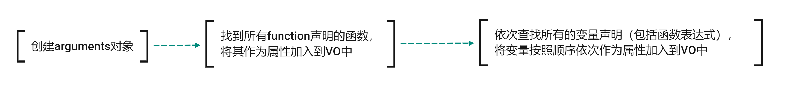

## 执行上下文与作用域

### 执行上下文保存的是当前代码的执行环境，这个执行环境形成了作用域。

1、上下文里面保存的是代码的执行环境，有了上下文js引擎才知道当前正在执行的代码中的所用到的变量、函数、this等值从哪里来。

2、上下文可以分为：全局上下文、函数上下文、eval上下文（不推荐使用，所以不讨论）。其实全局上下文也可以看做是一个函数上下文，因为全局执行时其实是一个匿名函数在执行（通过看堆栈调用可以看到这点）。

3、很明显，在代码的执行过程中会形成多个执行上下文（就是一个全局上下文+多个函数上下文），这些上下文会在创建是被压入一个栈（称为执行上下文栈），全局上下文一定是栈底，当前正在执行的函数的上下文一定是栈顶，并且只会有当前执行上文是活动的，一旦当前函数执行完毕，就会被弹出栈，下一个上下文成为栈顶，变为活动的上下文。

4、函数上下文在函数执行完毕后就会被弹出栈并被销毁，全局上下文在页面关闭后被销毁。

### 上下文的生命周期

生命周期分为三个阶段：创建阶段=》执行阶段=》销毁阶段。

#### 创建阶段

1、生成变量对象VO

变量对象其实就是一个环境记录对象，而环境记录对象又分为词法环境对象（静态环境对象）和变量环境对象。词法环境对象中保存的是由const声明的不可变变量，变量环境对象中保存的是var、let声明的可变变量（为了简单，下文将两个变量对象统一成一个变量对象讨论）。

- 查找arguments作为属性

js编译器会检查函数参数，并将其作为VO对象的属性加入VO。

- 查找function声明的函数作为属性

js编译器按顺序查找代码中通过函数声明这种方式声明的函数（ES6之后可以省略function关键字，所以查找的是函数声明），将这个函数名称作为属性加入VO。

- 查找普通变量作为属性

js编译器按顺序查找代码中所有声明的变量，包括函数表达式中声明的变量，将这些变量名作为属性加入到VO对象中。

匿名函数会被加入到VO中吗？

2、创建阶段结束后，VO中保存了arguments、function声明的函数名、var/let/const声明的变量名，但是并没有给这些属性赋值！所以此时这些属性都是无法访问的，赋值操作会在执行阶段进行。

#### 执行阶段

#### 销毁阶段

### 全局上下文的特殊点

