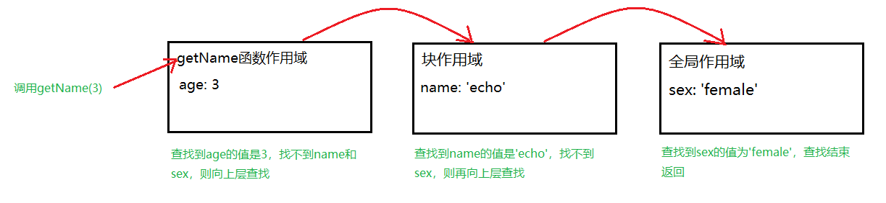

## 由一个问题引发的闭包思考

看到一个问题：在JS中，每个函数都是闭包。那下面这段代码是否形成了闭包呢？

```JavaScript
var name = 'ltt';
(function getName() {
    console.log(name);
})();
```

有人说对，因为闭包就是引用了**自由变量**的函数，这里的name对于getName()函数来说就是自由变量。

特别解释下，**自由变量**是指在函数中引用的一个不属于当前函数作用域的变量（它既不是函数参数，也不是函数内部变量）。

也有人说不对，闭包是引用了其他函数内部变量的函数，使得在外部也可以访问到函数内部变量（要有返回）。


一直很纠结这两种说法，就先查一下MDN官方文档吧：

> 一个函数和对其周围状态（**lexical environment，词法环境**）的引用捆绑在一起（或者说函数被引用包围），这样的组合就是**闭包**（**closure**）。也就是说，闭包让你可以在一个内层函数中访问到其外层函数的作用域。在 JavaScript 中，每当创建一个函数，闭包就会在函数创建的同时被创建出来。

这个解释很难一下子看懂，但是我注意到了最后这句话**在JavaScript中，每当创建一个函数，闭包就会在函数创建的同时被创建出来**。看来MDN文档中对闭包的解释，更倾向于上面的第一种看法，即“引用了自由变量的函数就是闭包”。

接下来，深入一点去理解闭包，看看能不能解释为什么对闭包有上述两种看法。


## 词法作用域

词法作用域并不是什么新词，在语言层面上，有词法作用域和动态作用域之分。JavaScript使用的就是词法作用域，也成为静态作用域。

可以这么来区分这两种作用域：

1、词法作用域，是在代码书写过程中，基于代码的书写位置来划分作用域的。

2、动态作用域，是在代码运行过程中，基于调用栈来划分作用域的。


举个简单例子：

```javascript
var name = 'ltt';

function getName() {
    console.log(name);
}

function changeName() {
    var name = 'echo';
    getName();
}

changeName(); // ltt

```

最后一行changeName()的执行结果是'ltt'，这正是符合词法作用域的规则。

首先来根据**词法作用域来划分**上述代码的作用域：


全局作用域下有一个变量name，和两个函数getName、changeName，在getName函数作用域下没有声明任何变量，在changeName函数作用域有一个name变量，这个name和全局作用域下的name是没有关系的。

* 调用getName函数时，会先在自己的作用域下查找是否有name，发现没有；
* 接着往上层作用域即全局作用域下查找name，找到了name是'ltt'，所以运行结果是'ltt'。


再来根据**动态作用域来划分**上述代码的作用域：


* 在调用getName函数时，首先查找getName函数作用域下没有name变量；

* 接着查找上一层调用，是changeName函数作用域，找到该作用域下有name为'echo'，则执行结果应该是返回'echo'。


## JavaScript有3种作用域，闭包的形成

### JavaScript中有3种作用域

* 全局作用域：在任何函数之外的顶层作用域下声明的变量就是全局变量，这样的作用域就是全局作用域
* 函数作用域：在函数内部声明的变量，包括函数参数、内部局部变量
* 块作用域（ES6中引入）：在ES6之后，{}这样一个大括号就形成了一个块级作用域，在这个作用域下使用let和const声明的变量只能在这个块作用域下使用

在实际开发过程中，往往出现的不是单一的作用域，而是作用域嵌套，形成了**作用域链**。

看个简单例子：

```javascript
let name = 'ltt';
let sex = 'female';
{
   let name = 'echo';
   function getName(age) {
       console.log(name + ' is ' + sex + ', and age is ' + age);
   }
}
getName(3); // echo is female, and age is 3
```

上面这段代码中，有3个作用域，第一个顶层全局作用域，第二个是块作用域，第三个是函数作用域，形成了下面图中所示的作用域嵌套。


在执行时，形成的作用域链如下图所示：



### 闭包的形成                                                  

根据上面所述的作用域链，划分下面代码执行时的作用域链：

```javascript
var a = 0;
function outside() {
    let a = 1;
    function inside() {
        console.log(a);
    }
    return inside; // 闭包
}

var test = outside(); // (*)
test(); // 1
```


这个例子非常简单，作用域链的调用也非常清楚，通过这个作用域链的查找，可以很明显的看出在inside函数中打印的变量a就是outside函数中声明的a=1。inside函数是outside函数的内部函数，outside函数是inside函数的外部函数，而inside函数内部又引用了它的外部函数的变量（自由变量a），这样就形成了一个闭包。

注意在（*）这行执行时，是将inside函数返回给了变量test，变量test是在outside函数的外部声明的，因此在执行test函数时，我们就能得到outside函数内部变量a的值，否则的话，我们无法在outside函数的外部拿到它内部变量a的值。


到这里，我们应该就有一个初步的认知，JavaScript中闭包的形成，和词法作用域模型下的作用域链，以及函数中返回函数有关系。

那么回到最初的那个立即执行函数的例子中：

```javascript
var name = 'ltt';
(function getName() {
    console.log(name);
})();
```

这里面有一个立即执行函数，它引用了外部的name变量，但是这里并没有一个return，那这里是否形成了闭包呢？

**我的理解是，这也形成了闭包，因为在getName函数中，确实引用了一个自由变量name，并且因为立即执行后，在外部的全局作用域下访问到了name。这就很奇怪了，因为name变量本来就在全局作用域下，不需要通过getName函数来获取，所以这里形成的闭包并没有什么具体作用。**

```javascript
var a = 0;
function outside() {
    let a = 1;
    function inside() {
        console.log(a); // 这里引用了自由变量a
    }
}

var test = outside(); // （*）
```

**outside函数并没有返回inside函数，所以即使在inside函数中可以访问outside下的a，但是在全局作用域下，仍然没有办法获取到outside下的a，这样的闭包也没有产生具体的作用，但inside函数确实形成了闭包。**

那么闭包有什么具体的作用呢，或者说闭包有哪些应用场景呢？


## 闭包的应用

闭包有哪些应用，取决于闭包有什么特点，我们能利用这些特点干什么事。


### 模拟私有变量

JavaScript是面向对象的语言，但与Java这类的语言不同，JavaScript的面向对象本质上是基于原型链实现的，强调的是“对象”，Java这类的语言是基于类来实现面向对象的，强调的是“类”。

那强调“对象”和强调“类”有什么不同之处呢？

面向对象有两个基本概念：

1、类：是对象的类型模板。

2、实例：是根据类创建出来的具体的对象

但是在JavaScript中，是没有类型模板的，也就是没有类这个概念，只有实例，然后通过原型链建立起了不同实例之间的继承关系。（具体的可以看参考2的文章）


在JavaScript中没有类，就会导致没有私有变量


### 实现偏函数和柯里化


## 参考

1、https://zh.wikipedia.org/wiki/%E9%97%AD%E5%8C%85_(%E8%AE%A1%E7%AE%97%E6%9C%BA%E7%A7%91%E5%AD%A6)

2、https://www.liaoxuefeng.com/wiki/1022910821149312/1023022126220448


