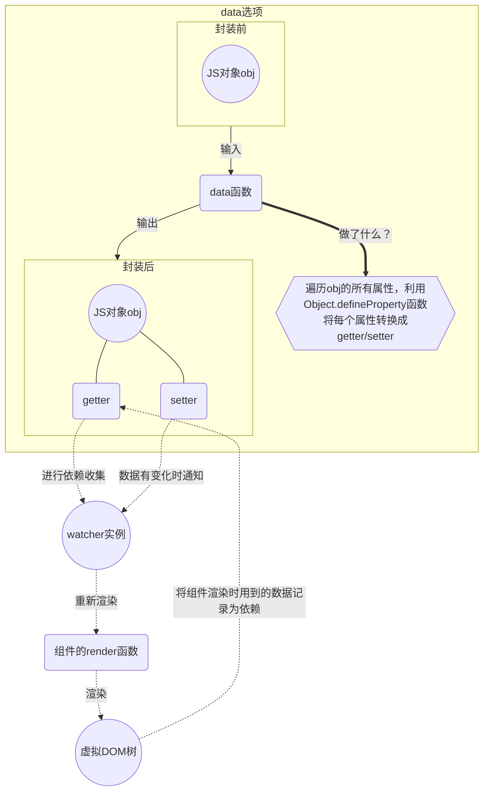

# Vue的特性之一——响应式

## 响应式基础

### 1、什么是响应式，作用？

当用户在页面进行一些交互时，比如点击一个按钮进行查询，这样一个简单的动作，实际上需要先捕获到用户操作的DOM元素上对应的事件，在这个事件的具体实现中，会发起一个异步请求来获取后端返回的数据，然后将这个数据处理后再渲染到页面上。这一整套的流程，其实涉及两个数据流向，一是从HTML流向JS，另一个是从JS流向HTML。如果使用纯原生js开发，则需要开发者自行实现对DOM元素的事件监听（HTML流向JS），以及将数据传递给DOM（JS流向HTML）。

纯原生JS开发的缺点是，开发者需要自行处理的事件监听太多，还要懂得什么时候将数据传递给DOM，并且还可能出现数据的频繁更新导致DOM渲染过于频繁而出现页面卡顿。

早期的JQuery框架，将开发者对DOM元素的捕获以及事件监听封装起来，提供了很多便捷的API，而现在流行的三大框架，则进一步弱化了开发者对DOM的处理，开发者可以专注于逻辑处理（JS的部分），vue这样的框架使得数据在更新后能适时的渲染到页面上，同时也简化了事件监听的处理，开发者无需再写一大堆addEventListener了。


### 2、怎么使用Vue中的响应式

在Vue3中允许使用**选项式API**或者**组合式API**两种方式来书写组件，其中选项式API也是组合式API基础上实现的，在这两种书写风格下，声明响应式数据的写法不相同。

#### 声明响应式状态

##### 选项式API

- 使用data选项来声明
- data选项是一个函数，函数中必须返回一个对象
- Vue在创建组件实例时会调用此函数，并且将该函数返回的对象用响应式系统进行包装
- 这个对象的所有顶层属性都会被代理到组件实例上（在组件中用this可以访问到这些顶层属性）

```javascript
export default {
    data() {
        return {
            count: 0
        }; // 返回一个对象，对象中的属性是响应式的
    }
}
```


##### 组合式API

**reactive()**

- 仅仅用于声明引用类型的声明（响应式对象、数组、set、map等）
- 响应式对象本质是一个Proxy
- 为了在模板中可以使用响应式状态，需要在setup函数中定义并返回，或者使用<script setup>
- 有2个局限性
  - 只对对象类型有效，对原始类型无效
  - 只能保持对初始引用对象的响应追踪（如果对响应式对象进行重新赋值，会导致原始的响应式对象失去追踪）

```javascript
import { reactive } from "vue";

export default {
    // setup是一个专门用于组合式API的特殊钩子函数
    setup() {
        const state = reactive({ count: 0 });
        return {
            state // 暴露state到模板
        }
    }
}
```

```vue
// 或者
<script setup>
import { reactive } from "vue";

const state = reactive({ count: 0 });
</script>
```


**ref()**

- 可用于创建任意类型的响应式数据
- ref()函数将传入的任意值包装为一个带.value属性的ref对象
- ref创建的响应式对象不会丢失响应性（被解构，被传递时）


##### 对比和总结

<table>
    <thead>
        <tr>
            <th></th>
            <th>选项式API</th>
            <th colSpan="2">组合式API</th>
        </tr>
    </thead>
    <tbody>
        <tr>
            <td>实现原理</td>
            <td>getter/setter</td>
            <td>Proxy</td>
            <td>getter/setter</td>
        </tr>
        <tr>
            <td>声明响应式对象</td>
            <td>data()函数</td>
            <td>reactive()函数</td>
            <td>ref()函数</td>
        </tr>
        <tr>
            <td>
                解构响应式对象<br />
                （将对象属性结构为局部变量，对局部变量是否仍具有响应性）
            </td>
            <td>
                局部变量失去响应性<br />
                （因为对局部变量的访问不会触发getter/setter）
            </td>
            <td></td>
            <td></td>
        </tr>
    </tbody>
</table>


**reactive()和ref()的区别和使用场景**


### DOM的更新时机


### 深层响应式对象


### 浅层响应式对象


### 声明方法


### 声明计算属性来描述响应式状态的复杂逻辑


## 响应式原理

### 1、vue2中的响应式原理

#### 建立依赖-追踪变化-响应变化


#### 总结


### 2、vue3中的实现原理

### 响应式代理 vs. 原始对象


如何实现依赖跟踪





